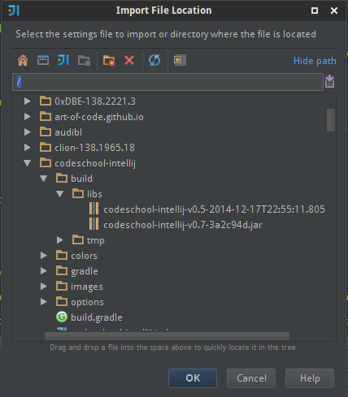
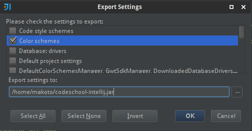
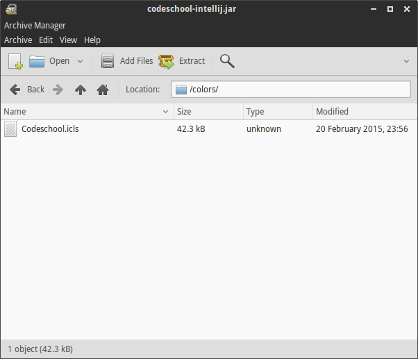

codeschool-intellij
===================

This is a theme in the spirit* of the Codeschool theme for Vim, found at [AstonJ's website](http://astonj.com/tech/vim-for-ruby-rails-and-a-sexy-theme/).

The theme here is geared towards IntelliJ IDEA use, and is recommended for users of the Darcula skin, or those that prefer dark themes in general.

*This was formerly a port, but there are likely some artistic liberties taken in this version.

This project makes use of IntelliJ's import functionality (based out of IntelliJ IDEA 14).  If you are using a JetBrains product that allows the import of custom themes, then this theme *should* work for you.

Officially Supported IDEs
==============

 - IntelliJ IDEA
 - 0xDBE
 - RubyMine
 - PyCharm

If your JetBrains IDE isn't on the list, give it a try anyway - let me know if it works without any major issues.

How to Build
============

We provide the Gradle Wrapper for you to use.

Once the project is cloned, navigate to the `gradle/` directory, and run this command:

 - Linux/OS X:

        ./gradlew jar

 - Windows:

        gradlew.bat jar

...and you will have a copy of the theme in your `build/libs` directory.

The JAR will be named with respect to the most recent tagged version for your branch.

If you're building directly off of `master`, you'll see a JAR name like this:

    codeschool-intellij-v0.7-3a2c94d.jar

If you are building locally, and you're on a branch that isn't in sync with the latest tag, then you'll see a JAR name like this:

    codeschool-intellij-v0.5-2014-12-17T22:55:11.805-07:00.jar

How to Install
==============

Under File > Import Settings, navigate to the folder in which the JAR was built.

 

Import the color theme from it - it is the only available option to check.

How to Contribute
=================

If you make a change to the theme, navigate to File > Export Settings.  Only select the "Color schemes" option.

 
 
Take only the `colors/Codeschool.icls` file out of the JAR file, and place it into the project's `colors/` directory.

 

Commit that and submit a pull request.

Filing Bugs
===========

If you want to file a bug, please include the version number (prefixed by 'v') of the JAR that was generated. This will help in isolating when a particular bug/regression was introduced.

Sample Gallery
==============

Generics and Breakpoint

 
 
Landing on a Breakpoint

 

 Annotation Coloring

 

 Diff Window Coloring

 

Terminal Error Message Coloring
 
 

---

Feedback, patches, and pointing out general usability problems are always welcome.

