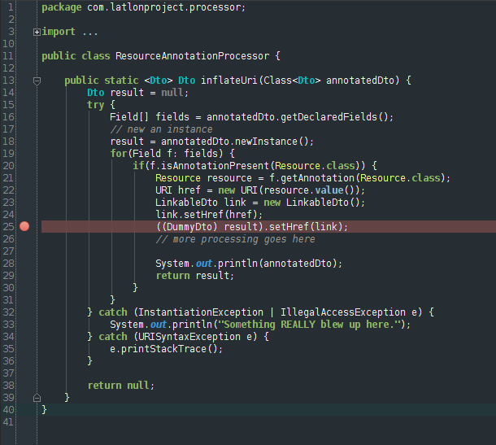
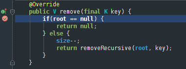
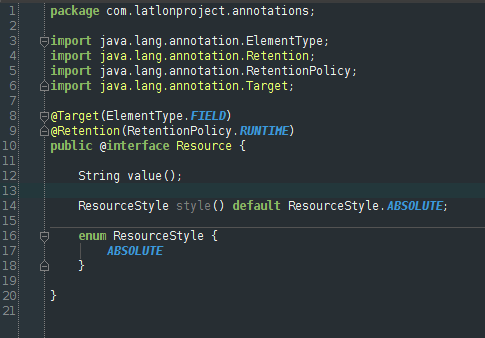
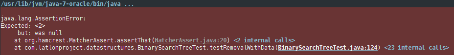

codeschool-intellij
===================

This is a port of the Codeschool theme for Vim, found at AstonJ's website:

http://astonj.com/tech/vim-for-ruby-rails-and-a-sexy-theme/

The theme here is geared towards IntelliJ IDEA use, and is recommended for users of the Darcula skin, or those that
prefer dark themes in general.

Things to keep in mind:

 - This is **heavily** geared towards a Java/JSP developer; bugs likely exist for your language of choice.
 - This has not been tested with any of the other JetBrains IDEs.  Breakage or incompatibility *may* arise.

Sample Gallery
==============

Generics and Breakpoint

 
 
Landing on a Breakpoint

 

 Annotation Coloring

 

 Diff Window Coloring

 

Terminal Error Message Coloring
 
 

How to Build
============

This project uses Gradle to assemble the JAR.  Ensure that you have gradle installed, and run the command:

    gradle jar

...and you should have the working copy in your build/libs directory.

How to Install
==============

Under File > Import Settings, navigate to the folder in which the JAR was built (likely build/libs).  Import the color theme from it.

---

Feedback, patches, and pointing out general usability problems are always welcome.

