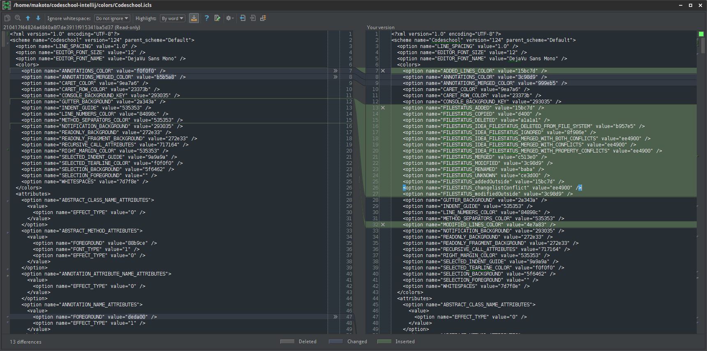

codeschool-intellij
===================

This is a port of the Codeschool theme for Vim, found at AstonJ's website:

http://astonj.com/tech/vim-for-ruby-rails-and-a-sexy-theme/

The theme here is geared towards IntelliJ IDEA use, and is recommended for users who prefer a dark IDE background.

Things to keep in mind:

 - Vim is a lot more liberal with its code style denoters, so we can't get different colored return types in Java yet.
 - This is **heavily** geared towards a Java/JSP developer; bugs likely exist for your language of choice.
 - Bugs likely exist regardless.  Patches are welcome and desirable.
 - This theme goes (very!) well with Darcula.
 - This has not been tested with any of the other JetBrains IDEs.  Breakage or incompatibility *may* arise.

Sample Gallery
==============

Generics and Breakpoint

 

 Annotation Coloring

 

 Diff Window Coloring

 

How to Build
============

This project uses Gradle to assemble the JAR.  Ensure that you have gradle installed, and run the command:

    gradle jar

...and you should have the working copy in your build/libs directory.

How to Install
==============

Under File > Import Settings, navigate to the folder in which the JAR was built (likely build/libs).  Import the color theme from it.

---

Feedback, patches, and pointing out general usability problems are always welcome.

